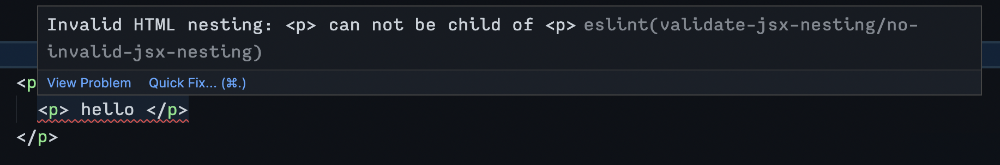

# eslint-plugin-validate-jsx-nesting

Find Invalid HTML Nesting in JSX, like this:



## Why this validation is important?

without such validation, When JSX is converted to HTML and rendered in the DOM, the browser will try to fix the invalid nestings ( such as `<hr>` inside `<p>` ) and thus the rendered DOM will have a different structure than the JSX structure.

This is a big issue for frameworks that rely on JSX rendering the exact same elements in DOM. This can lead to unexpected behaviors.

Validation library
This babel plugin uses [validate-html-nesting](https://github.com/MananTank/validate-html-nesting) library for validating html element nesting

This ESLint plugin works with any framework that uses JSX.

<br/>

## Usage

### Add in list plugins

Add `"eslint-plugin-validate-jsx-nesting"` to the plugins section of your ESLint configuration file. You can omit the eslint-plugin- prefix if you want.

```json
{
	"plugins": ["validate-jsx-nesting"]
}
```

### Add the rule

Add the `"validate-jsx-nesting/no-invalid-jsx-nesting"` rule in your ESLint config file.

```json
"rules": {
	"validate-jsx-nesting/no-invalid-jsx-nesting": "error"
}
```

<br />

## See also: Related Libraries

- [babel-plugin-validate-jsx-nesting](https://github.com/MananTank/validate-jsx-nesting)
- [validate-html-nesting](https://github.com/MananTank/validate-html-nesting)
